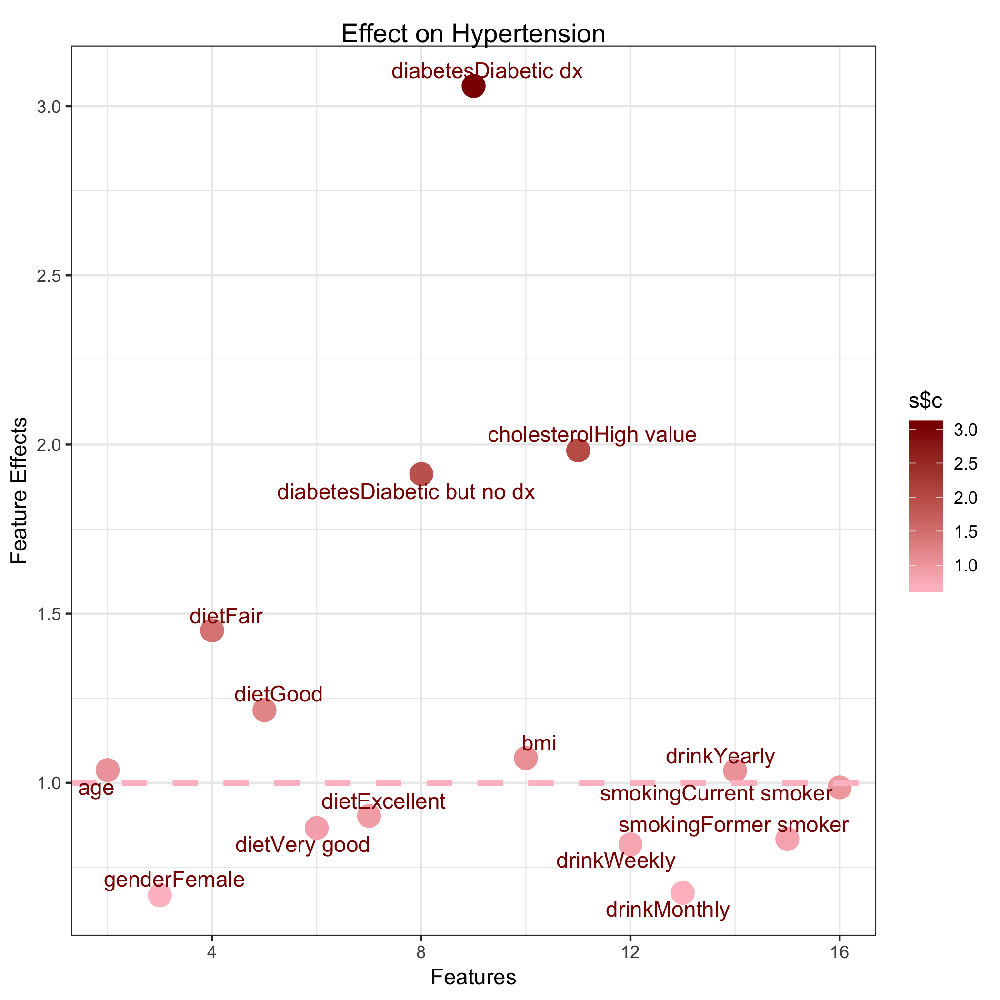

```{r setup, include=FALSE}
knitr::opts_chunk$set(echo = TRUE,message = FALSE,warning = FALSE)
```


## Motivation

The link between hypertension and some physical measurements is well-established in previous studies. In this case study, moving beyond the traditional aspects, we will explore other risk factors and their potential probability of getting hypertension.

This case study also introduces logistic regression and survey-weighted logistic regression, focusing on the difference between them. As we are using survey data, we show the second one is a good choice of model in this setting.

<center>
 
</center>

## What is the Data

 [NYC HANES 2013-14 Blood Pressure Data](http://nychanes.org/data/): We download NYC HANES Analytics Datasets here. It also provides other useful resourses such as 'Data Documents', 'Variable List','Aanlytics Guideline','Questionaire'. All of them enable data users to understand the meaning and encoding of the variables better and do their analysis more efficiently.


## Other Resource


1. [National Health and Nutrition Examination Survey (NHANES)](https://wwwn.cdc.gov/nchs/nhanes/default.aspx): A program of studies designed to assess the health and nutritional status of adults and children in the United States.
NYC HANES is a local version of NHANES, which implies it mainly focus on New York area. Modeling on NHANES, NYC HANES collected data from a physical examination and laboratory tests, as well as interviews. 
2. [R package nhanesA](https://cran.r-project.org/web/packages/nhanesA/vignettes/Introducing_nhanesA.html): This package was developed to enable fully customizable retrieval of data from NHANES, such as load data, list variables in NHANES table.


## Data Preprocessing

### Load packages
Since this is the first R code chunk, we will load the necessary libraries.
```{r libraryLoad, warning=FALSE, message=FALSE}
library(knitr)
library(ggplot2)
library(ggpubr)
library(ggrepel)
library(tableone)
library(kableExtra)
library(survey)
library(broom)
library(Rmisc)
library(tidyverse)
library(haven)
library(jtools)
```


### Load Data


It is a SAS formatted file so we will use the function `read_sas` from the `haven` library to read it into a data frame in R. `haven` library is useful to import and export 'SAS', 'STATA', and 'SPSS' file.

```{r readData}
dat <- read_sas('./data/dat.sas7bdat')
#dat <- read.sas7bdat('./data/dat.sas7bdat')
```


This data set contains `r nrow(dat)` observations of `r ncol(dat)` different variables. For our analysis, we may select only a subset of the variables.

### Select the variables that we are interesed in

As we mentioned above, this is a survey dataset based on interview or questionaires with `r ncol(dat)` variables. Some vairables are meaningless to our research interest, such as 'LAQ1: What language is being used to conduct this interview'. 

Previous people showed hypertension has relationship with drink, smoking, cholesterol values, triglyceride. Except for them, we still want to choose other covariates which might not be highly-related, such as income, and try to see whether they have a potential association with hypertension. Therefore, based on our interest, finally selected 13 covariates are kept.  


Here, we use the `select` function to choose and rename the columns that we want.

```{r selectCols}
hypertension_DF <- dat %>% 
  select(
id = KEY,
age = SPAGE,
race = DMQ_14_1,
gender = GENDER,
diet = DBQ_1,
income = INC20K,
diabetes = DX_DBTS,
bmi = BMI,
cholesterol = BPQ_16,
drink = ALQ_1_UNIT,
smoking = SMOKER3CAT,
hypertension = BPQ_2,
surveyweight = CAPI_WT
)
#WHQ_2LB,
```
Here are explanation for these variables:

-Non Categorical

  * id: Sample case ID
  * age: Sample age, range 22-115
  * bmi: BMI = kg/m2 where kg is a person's weight in kilograms and m2 is their height in metres squared
  * surveyweight: surveyweught
  
-Categorical

  * race: 
    + 100 = White
    + 110 = Black/African American
    + 120 = Indian
    + 140 = Native Hawaiian/Other Pacific Islander
    + 180 = Asian
    + 250 = Other race
  * gender:
    + 1 = Male
    + 2 = Female
  * born:
    + 1 = Us born
    + 2 = Other country
  * diet: 
    + 1 = Excellent
    + 2 = Very good 
    + 3 = Good
    + 4 = Fair
    + 5 = Poor
  * diabetes: Previously diagnosed with diabetes
    + 1 = Diabetic with dignosis
    + 2 = Diabetic without dignosis 
    + 3 = Not diabetic
  * cholesterol: An oil-based substance. If concentrations get too high, it puts people at risk of heart diseases
    + 1 = High cholesterol value
    + 2 = Low cholesterol value
  * drink: In the past 12 months, how often did sample drink any type of alcoholic beverage
    + 1 = Weekly
    + 2 = Monthly
    + 3 = Yearly
  * smoke: 
    + 1 = Never smoker
    + 2 = Current smoker
    + 3 = Former smoker
  * income:
    + 1 = Less than $20,000
    + 2 = $20,000 - $39,999
    + 3 = $40,000 - $59,999
    + 4 = $60,000 - $79,999
    + 5 = $80,000 - $99,999
    + 6 = $100,000 or more
  * hypertension: Previously diagnosed as hypertension
    + 1 = Yes
    + 2 = No
    
### Data Wragling

The first step of any data analysis should be to explore the data through calculating various summary statistics. There are several ways that you can have a glance at your data. Plotting the data or using the `summary` or `glimpse` functions are also excellent ways to understand your data at first sight.

The `glimpse` function will return the name of the variables along with their type and some values. It helps you to check the levels and missing values in the categorical data. The `glimpse` function does something similar.

```{r firstLook}
#glimpse(hypertension_DF)
```


The `summary` function tabulates categorical variables and provides summary statistics for continuous ones, while also including a count of missing values, which can be very important in deciding what variables to consider in downstream analysis.

```{r}
summary(hypertension_DF)
```
We find  NA's occupy big parts of the dataset, even 412 for 'drink' and 281 for 'diabetes'. Directly removing rows containing missing data is not appropriate considering its large amount. So we try to check the variable list again and find another variable 'AlQ_1' : how often did SP drink any type of alcoholic beverage? 0 means they never drink.

Let's see its distribution with function `table()`.

```{r}
table(dat$ALQ_1)
```
The result answers why there are so many missing value for 'drink'. In these 412 missing value, 406 sample never drink and there are just 6 real missing value. Therefore, merging these two as one is a better choice to avoid losing too many observations.

```{r}
hypertension_DF$drink[which(dat$ALQ_1==0)] <- 4
summary(hypertension_DF$drink)
```
With the help of function `which()`, we just have 6 missing value for 'drink' now.

Next step we aim to remove rows containing missing data with a nice function `drop_na()` in library `tidyr` and store in a new dataframe:

```{r}
DF <- hypertension_DF %>%
  drop_na()
```

Finally we remain `r nrow(DF)` observations of `r ncol(DF)` different variables.

### Adjust Data Type

From the data summaries above, we can see that there are several categorical variables like race, gender, born, diet, income, diabetes, BMI, drink, and smoke, which are currently being treated as numerical values.

For these variables, it is important for us to adjust the coding, prior to doing any analysis in R. Since different value represent nothing but different categories. Sometimes people forget to change the type of data, and usually, it will give you a totally wrong result.

For example, in ` lm()` and ` glm()`, the function will treat numerically-coded categorical variables as continuous variables, which will give the wrong result. Instead, we want to convert these categorical variables to factors. Before doing this, we want to get a better understanding of exactly what values are stored in the different variables.


The first step for these categorical variables is to change them to factors. We refer to the codebook to get the correct mapping of the numerical values to the category labels.


We can use the `factor` function to convert each variable and assign the correct levels. Any values that are not included in the 'levels' argument will get set to 'NA' values.
```{r recodeFactors}
DF$race <- factor(DF$race, levels=c(100, 110, 120, 140, 180, 250), 
labels=c('White', 'Black/African American', 
'Indian /Alaska Native',
'Pacific Islander', 'Asian', 'Other Race'))

DF$gender <-  factor(DF$gender, levels=c(1,2), 
labels=c('Male', 'Female'))

DF$diet <-  factor(DF$diet, levels=c(1:5), 
labels=c('Excellent', 'Very good', 'Good', 'Fair', 'Poor'))

DF$income <-  factor(DF$income, levels=c(1:6), 
labels=c('Less than $20,000','$20,000 - $39,999',
'$40,000 - $59,999','$60,000 - $79,999',
'$80,000 - $99,999','$100,000 or more'))

DF$diabetes <-  factor(DF$diabetes, levels=c(1:3), 
labels=c('Diabetic dx','Diabetic but no dx','Not diabetic'))

DF$cholesterol <-  factor(DF$cholesterol, levels=c(1,2), 
labels=c('High value', 'Low value'))

DF$drink <-  factor(DF$drink, levels=c(1,2,3,4), 
labels=c('Weekly', 'Monthly', 'Yearly','Never'))

DF$smoking <-  factor(DF$smoking, levels=c(1:3), 
labels=c('Never smoker', 'Current smoker', 'Former smoker'))

DF$hypertension <-  factor(DF$hypertension, levels=c(1,2), 
labels=c('Yes', 'No'))
```


### Plotting Categorical Data

Plotting numerical data is something you may be familiar with. This time we are going to incorporate some of the categorical variables into the plots. Although going from raw numerical data to categorical data bins does give you less precision, it can make drawing conclusions from plots much easier.

First, we try to plot one categorical variable 'hypertension', with one numerical variable 'age' and with one catergorical variable 'gender'. 

```{r,fig.width=10, fig.height=6}
p1 <- ggplot(DF, aes(x = hypertension, y=age))+
  geom_boxplot()+ggtitle('distribution of age')
p2 <- ggplot(DF, aes(x = hypertension, y=gender))+ 
  geom_boxplot()+ggtitle('distribution of gender')
ggarrange(p1,p2)
```
It seems that the second plot fails to show the relationship! So we find it is not appropriate to apply traditional plotting methods on two categorical variables. Then, we think about the other way:

```{r,fig.width=6, fig.height=4}
ggplot(DF, aes(x = hypertension, fill = gender)) + 
  geom_bar()+ggtitle('distribution of gender')
```

This time it works! If you want to figure the proportion of male and female for each level, just change the position attribute of the bar plot to `fill`.

```{r,fig.width=6, fig.height=4}
ggplot(DF, aes(x = hypertension, fill = cholesterol)) + 
  geom_bar(position = "fill")+ggtitle('distribution of cholesterol')
```

The plot fits the real world condition very well: People without hypertension are mainly those who has low cholesterol value.

Simple data visualization will help you to make a first step judgement and provide much information. Plots indicate the trend, or pattern of the distribution of variables you interested in, and inspire you how to do the next step in data analysis. You can use this method to see the relationship between hypertension and other categorical variables.


### Check Normality of the Numeric Variables
Now we have a clean dataset. To explore the data more, we need to do some analysis on the data and to check some other features of them.

One thing that we want to do first is to check the normality of the continuous variables to help us decide what test statistics to use. 
The numerical varialbes we have in our data set are `age` and `bmi`.

```{r,ig.width=6, fig.height=4}
par(mfrow = c(2,2))
qqnorm(DF$age,main = 'age')
qqline(DF$age)
qqnorm(DF$bmi, main = 'bmi')
qqline(DF$bmi)
qqnorm(log(DF$age),main = 'log of age')
qqline(log(DF$age))
qqnorm(log(DF$bmi), main = 'log of bmi')
qqline(log(DF$bmi))
```

Based on these plots, both variables may not need additional transformation.


## Survey Weighted Data


So what model can we use in our case?

+ binary outcomes

You might think of logistic regression. Yes, you're pretty close already. However, think of the nature of our dataset. It's a data obtained from survey, and there is an important point to consider for analysis of survey data.


### What is Survey Weighted Data

It possible and indeed often happens to a perfectly designed sampling plan ends up with too many samples in a category. For example, too many women and not enough men, or too many white and not enough other races or both. Data weighting make sense for this kind of data. If we want the data to reflect the whole population, instead of counting the weight of each data point as one, we weight the data so that the sample we have can better reflect the entire community.


### What is the Weight of Data


Assuming that you have 25 students (20 male and 5 female) in your class, and you want to talk with 5 of them to know their understanding of the biostatistics class. By sampling 5 students from the total 25 students, you might get 5 all female students or 4 female and 1 male in your sample. Do you expect this sample to represent the population? Of course not. That's why we have to weight the observation so that we can make the sample better represent the population. The way of calculating the weight is:


$$Weight = \frac{Proportion~in~population}{Proportion~in~sample}$$
$$Male~Weight = \frac{20/25}{1/25} = 20$$
$$Female~Weight = \frac{5/25}{4/25} = 1.25$$


When we have multiple strata on the data, it might be troublesome to calculate the weight. However, for most of the survey data, the weight is calculated and included in the dataset. In our case study, the weight is calculated and we can simply apply the weight in the survey-weighted logistic regression.


### What is Finite Population Correction Factor

$$FPC = (\frac{N-n}{N-1})^{\frac{1}{2}}$$
 
 + N = population size
 + n = sample size


The finite population correction (fpc) is used to reduce the variance when a substantial fraction of the total population of interest has been sampled. It may not be appropriate if the target of inference is the process generating the data rather than the statistics of a particular finite population.

The Finite Population Correction Factor (FPC) is used when you sample without replacement from more than 5% of a finite population. It's needed because under these circumstances, the Central Limit Theorem does not hold and the standard error of the estimate (e.g. the mean or proportion) will be too big. In basic terms, the FPC captures the difference between sampling with replacement and sampling without replacement.
```{r}
N <-  6825749
n <- 1061
fpc <- ((N - n)/(N-1))^0.5
fpc
```


### Create the Survey Weight Data

There is a function ` svydesign()` in R package ` survey`. The function combines a data frame and all design information needed to specify a survey design. Some arguments that is useful in our analysis.

 + ids: Formula or data frame specifying cluster ids from largest level to smallest level, ~0 or ~1 is a formula for no clusters.

 + data: Data frame to look up variables in the formula arguments, or database table name

 + weights = Formula or vector specifying sampling weights as an alternative to ` prob`

 + fpc: Finite population correction


```{r}
hypertension2 <- DF$hypertension
hypertension2 <- ifelse(hypertension2 == 'No',0,1)
hypertension_design <- svydesign(
  id = ~1,
  data = DF[,-c(1,13)],
  weights = ~DF$surveyweight,
  fpc = ~rep(fpc, nrow(DF))
)
```

The arguments are interpreted as the following:

+ ids = ~1 means there is no clustering.

+ data = DF[,-c(1,13)] tells `svydesign` where to find the actual data.

+ fpc = ~rep(fpc,nrow(DF)): The function call rep(fpc,nrow(DF))  generates a vector of length n where each entry is N (the population size).

`summary()` shows the results:
```{r}
summary(hypertension_design)
```

"Independent sampling design" means that the sampling design is an SRS. When the population size is specified (via the fpc argument) it is assumed that the SRS is without replacement. By setting other parameters you can also design differenct kinds of design, such as stratified sampling etc.

Once we created a `survey.design` object, we can do futher analysis. It is very convenient to use `svy*` funtions which are corresponds to built in R functios but account for survey design features.

To calculate the mean, use function`svymean()`:
```{r}
svymean(~bmi, hypertension_design)
```
Subgroup statistics is also easy to calculate with function `svyby()`:
```{r}
svyby(~bmi, by=~diet, design=hypertension_design, FUN = svymean)
```
If you are particulary interested in one group, you can use function `subset()` :
```{r}
svymean(~bmi, subset(hypertension_design,gender=="Female"))
```
Compare with the previous result, female's mean bmi is a little higher. 
To calculate the confidence interval, use  function `confint()` directly:
```{r}
confint(svymean(~bmi, hypertension_design))
```

## Survey Weight Data Analysis

## Fit Generalized Linear Regression

Logistic regression is widely used to deal with binary response variable, let's try it.


```{r}
g1 <- glm(hypertension~ .-id-surveyweight-hypertension, 
          family = binomial(link = "logit"),data = DF)
summary(g1)
```
The large p-value for 'smoking' and 'drink' indicate they has no contribution to hypertension, which violate our common sense. Why we get this strange result? Remember our dataset is survey weight dataset, therefore we need to fit the model with the survey weighted data. Just use ` svyglm()` function from the ` suvery` package.

It's similary to fit a normal logistic regression, the only difference is that instead of using the orignal data set #in the ` data` argument, you should input the object from the ` svydesign()` to the ` esign` argument in the #function

```{r}
hypertension_design$variables$hypertension <- 
  ifelse(hypertension_design$variables$hypertension == 'No', yes = 0, no =1)
g2 <- svyglm(hypertension ~ 
    age+race+gender+diet+income+diabetes+bmi+cholesterol+drink+smoking, 
    family = binomial(link = "logit"), design = hypertension_design)
summary (g2)
```
`survey` computes the standard errors with consideration of the loss of precision introduced by sampling weights. Weights in `glm` simply adjust the weight given to the errors in the least squares estimation, so the standard errors aren't correct.
```{r,fig.width=7, fig.height=5}
g3 <- svyglm(hypertension ~ 
        age+gender+diet+diabetes+bmi+cholesterol+drink+smoking, 
        family = binomial(link = "logit"), design = hypertension_design)

s <- data.frame('c'=exp(g3$coefficients[2:16]),
                'l'=seq(from=2, to=16, by=1),
                'n'=names(g3$coefficients)[2:16])

plt<- ggplot(s,aes(x = l,y=c,col=s$c)) + 
  geom_point(size=5)+ 
  scale_colour_gradient(low ='pink', high = 'darkred')+
  geom_hline(yintercept = 1,col='pink',size=1.5,linetype=2)+
  theme_bw() + theme(plot.title = element_text(hjust = 0.5 ,vjust=-1.5))+
  geom_text_repel(aes(y = c,label=n),col='darkred')+
  ggtitle("Effect on Hypertension") + 
  ylab("Feature Effects") + 
  xlab("Features")
  
plt
```


