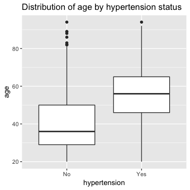
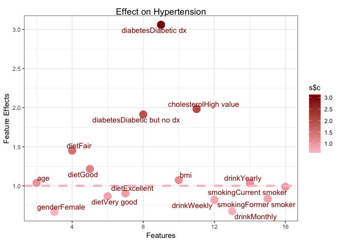

## Motivation

The link between hypertension and some physical measurements is well-established in previous studies. In this case study, moving beyond the traditional aspects, we will explore other risk factors and their potential probability of getting hypertension.

This case study also introduces logistic regression and survey-weighted logistic regression, focusing on the difference between them. As we are using survey data, we show the second one is a good choice of model in this setting.

<center>
 
</center>

## What is the Data

 [NYC HANES 2013-14 Blood Pressure Data](http://nychanes.org/data/): We download NYC HANES Analytics Datasets here. It also provides other useful resourses such as 'Data Documents', 'Variable List','Aanlytics Guideline','Questionaire'. All of them enable data users to understand the meaning and encoding of the variables better and do their analysis more efficiently.


### Other Resource


1. [National Health and Nutrition Examination Survey (NHANES)](https://wwwn.cdc.gov/nchs/nhanes/default.aspx): A program of studies designed to assess the health and nutritional status of adults and children in the United States.
NYC HANES is a local version of NHANES, which implies it mainly focus on New York area. Modeling on NHANES, NYC HANES collected data from a physical examination and laboratory tests, as well as interviews. 
2. [R package nhanesA](https://cran.r-project.org/web/packages/nhanesA/vignettes/Introducing_nhanesA.html): This package was developed to enable fully customizable retrieval of data from NHANES, such as load data, list variables in NHANES table.


## Data Preprocessing

### Load packages
Since this is the first R code chunk, we will load the necessary libraries.

```r
library(knitr)
library(ggplot2)
library(ggpubr)
library(ggrepel)
library(tableone)
library(kableExtra)
library(survey)
library(broom)
library(Rmisc)
library(tidyverse)
library(haven)
library(jtools)
library(plotrix)
```


### Load Data


It is a SAS formatted file so we will use the function `read_sas` from the `haven` library to read it into a data frame in R. `haven` library is useful to import and export 'SAS', 'STATA', and 'SPSS' file.


```r
dat <- read_sas('./data/dat.sas7bdat')
```


This data set contains 1527 observations of 704 different variables. For our analysis, we may select only a subset of the variables.

### Select the variables that we are interesed in

As we mentioned above, this is a survey dataset based on interview or questionaires with 704 variables. Some vairables are meaningless to our research interest, such as 'LAQ1: What language is being used to conduct this interview'. 

Previous people showed hypertension has relationship with drink, smoking, cholesterol values, triglyceride. Except for them, we still want to choose other covariates which might not be highly-related, such as income, and try to see whether they have a potential association with hypertension. Therefore, based on our interest, finally selected 13 covariates are kept.  


Here, we use the `select` function to choose and rename the columns that we want.


```r
hypertension_DF <- dat %>% 
  select(
id = KEY,
age = SPAGE,
race = DMQ_14_1,
gender = GENDER,
diet = DBQ_1,
income = INC20K,
diabetes = DX_DBTS,
bmi = BMI,
cholesterol = BPQ_16,
drink = ALQ_1_UNIT,
smoking = SMOKER3CAT,
hypertension = BPQ_2,
surveyweight = CAPI_WT
)
```
Here are explanation for these variables:

-Non Categorical

  * id: Sample case ID
  * age: Sample age, range 22-115
  * bmi: BMI = kg/m2 where kg is a person's weight in kilograms and m2 is their height in metres squared
  * surveyweight: surveyweught
  
-Categorical

  * race: 
    + 100 = White
    + 110 = Black/African American
    + 120 = Indian
    + 140 = Native Hawaiian/Other Pacific Islander
    + 180 = Asian
    + 250 = Other race
  * gender:
    + 1 = Male
    + 2 = Female
  * born:
    + 1 = Us born
    + 2 = Other country
  * diet: 
    + 1 = Excellent
    + 2 = Very good 
    + 3 = Good
    + 4 = Fair
    + 5 = Poor
  * diabetes: Previously diagnosed with diabetes
    + 1 = Diabetic with dignosis
    + 2 = Diabetic without dignosis 
    + 3 = Not diabetic
  * cholesterol: An oil-based substance. If concentrations get too high, it puts people at risk of heart diseases
    + 1 = High cholesterol value
    + 2 = Low cholesterol value
  * drink: In the past 12 months, how often did sample drink any type of alcoholic beverage
    + 1 = Weekly
    + 2 = Monthly
    + 3 = Yearly
  * smoke: 
    + 1 = Never smoker
    + 2 = Current smoker
    + 3 = Former smoker
  * income:
    + 1 = Less than $20,000
    + 2 = $20,000 - $39,999
    + 3 = $40,000 - $59,999
    + 4 = $60,000 - $79,999
    + 5 = $80,000 - $99,999
    + 6 = $100,000 or more
  * hypertension: Previously diagnosed as hypertension
    + 1 = Yes
    + 2 = No
    
### Data Wragling

The first step of any data analysis should be to explore the data through calculating various summary statistics. There are several ways that you can have a glance at your data. Plotting the data or using the `summary` or `glimpse` functions are also excellent ways to understand your data at first sight.

The `glimpse` function will return the name of the variables along with their type and some values. It helps you to check the levels and missing values in the categorical data. The `glimpse` function does something similar.


```r
#glimpse(hypertension_DF)
```


The `summary` function tabulates categorical variables and provides summary statistics for continuous ones, while also including a count of missing values, which can be very important in deciding what variables to consider in downstream analysis.


```r
summary(hypertension_DF)
```

```
##       id                 age             race           gender    
##  Length:1527        Min.   :20.00   Min.   :100.0   Min.   :1.00  
##  Class :character   1st Qu.:30.00   1st Qu.:100.0   1st Qu.:1.00  
##  Mode  :character   Median :42.00   Median :110.0   Median :2.00  
##                     Mean   :44.55   Mean   :136.8   Mean   :1.58  
##                     3rd Qu.:57.00   3rd Qu.:180.0   3rd Qu.:2.00  
##                     Max.   :97.00   Max.   :250.0   Max.   :2.00  
##                                     NA's   :59                    
##       diet          income         diabetes          bmi       
##  Min.   :1.00   Min.   :1.000   Min.   :1.000   Min.   :12.31  
##  1st Qu.:2.00   1st Qu.:1.000   1st Qu.:3.000   1st Qu.:23.33  
##  Median :3.00   Median :2.000   Median :3.000   Median :26.52  
##  Mean   :2.92   Mean   :2.985   Mean   :2.719   Mean   :27.73  
##  3rd Qu.:4.00   3rd Qu.:5.000   3rd Qu.:3.000   3rd Qu.:30.71  
##  Max.   :5.00   Max.   :6.000   Max.   :3.000   Max.   :69.17  
##  NA's   :3      NA's   :161     NA's   :281     NA's   :38     
##   cholesterol        drink          smoking       hypertension  
##  Min.   :1.000   Min.   :1.000   Min.   :1.000   Min.   :1.000  
##  1st Qu.:1.000   1st Qu.:1.000   1st Qu.:1.000   1st Qu.:1.000  
##  Median :2.000   Median :1.000   Median :1.000   Median :2.000  
##  Mean   :1.719   Mean   :1.726   Mean   :1.598   Mean   :1.726  
##  3rd Qu.:2.000   3rd Qu.:2.000   3rd Qu.:2.000   3rd Qu.:2.000  
##  Max.   :2.000   Max.   :3.000   Max.   :3.000   Max.   :2.000  
##  NA's   :15      NA's   :412     NA's   :3       NA's   :3      
##   surveyweight  
##  Min.   : 1030  
##  1st Qu.: 2875  
##  Median : 3648  
##  Mean   : 4116  
##  3rd Qu.: 4989  
##  Max.   :15422  
## 
```
We find  NA's occupy big parts of the dataset, even 412 for 'drink' and 281 for 'diabetes'. Directly removing rows containing missing data is not appropriate considering its large amount. So we try to check the variable list again and find another variable 'AlQ_1' : how often did SP drink any type of alcoholic beverage? 0 means they never drink.

Let's see its distribution with function `table()`.


```r
table(dat$ALQ_1)
```

```
## 
##   0   1   2   3   4   5   6   7   8  10  12  14  15  16  17  20  24  25 
## 406 267 276 183 100  80  40  68   7  25   9   6   6   1   1  14   6   2 
##  28  30  40  50  60 100 144 180 189 200 365 
##   1   8   1   1   1   1   1   1   1   1   7
```
The result answers why there are so many missing value for 'drink'. In these 412 missing value, 406 sample never drink and there are just 6 real missing value. Therefore, merging these two as one is a better choice to avoid losing too many observations.


```r
hypertension_DF$drink[which(dat$ALQ_1==0)] <- 4
summary(hypertension_DF$drink)
```

```
##    Min. 1st Qu.  Median    Mean 3rd Qu.    Max.    NA's 
##   1.000   1.000   2.000   2.333   4.000   4.000       6
```
With the help of function `which()`, we just have 6 missing value for 'drink' now.

Next step we aim to remove rows containing missing data with a nice function `drop_na()` in library `tidyr` and store in a new dataframe:


```r
DF <- hypertension_DF %>%
  drop_na()
```

Finally we remain 1065 observations of 13 different variables.

### Adjust Data Type

From the data summaries above, we can see that there are several categorical variables like race, gender, born, diet, income, diabetes, BMI, drink, and smoke, which are currently being treated as numerical values.

For these variables, it is important for us to adjust the coding, prior to doing any analysis in R. Since different value represent nothing but different categories. Sometimes people forget to change the type of data, and usually, it will give you a totally wrong result.

For example, in ` lm()` and ` glm()`, the function will treat numerically-coded categorical variables as continuous variables, which will give the wrong result. Instead, we want to convert these categorical variables to factors. Before doing this, we want to get a better understanding of exactly what values are stored in the different variables.


The first step for these categorical variables is to change them to factors. We refer to the codebook to get the correct mapping of the numerical values to the category labels.


We can use the `factor` function to convert each variable and assign the correct levels. Any values that are not included in the 'levels' argument will get set to 'NA' values.

```r
DF$race <- factor(DF$race, levels=c(100, 110, 120, 140, 180, 250), 
labels=c('White', 'Black/African American', 
'Indian /Alaska Native',
'Pacific Islander', 'Asian', 'Other Race'))

DF$gender <-  factor(DF$gender, levels=c(1,2), 
labels=c('Male', 'Female'))

DF$diet <-  factor(DF$diet, levels=c(5:1), 
labels=c('Poor', 'Fair', 'Good', 'Very good','Excellent'))

DF$income <-  factor(DF$income, levels=c(1:6), 
labels=c('Less than $20,000','$20,000 - $39,999',
'$40,000 - $59,999','$60,000 - $79,999',
'$80,000 - $99,999','$100,000 or more'))

DF$diabetes <-  factor(DF$diabetes, levels=c(3:1), 
labels=c('Not diabetic','Diabetic but no dx','Diabetic dx'))

DF$cholesterol <-  factor(DF$cholesterol, levels=c(2,1), 
labels=c('Low value','High value'))

DF$drink <-  factor(DF$drink, levels=c(4,1,2,3), 
labels=c('Never','Weekly', 'Monthly', 'Yearly'))

DF$smoking <-  factor(DF$smoking, levels=c(3:1), 
labels=c('Never smoker','Former smoker','Current smoker'))

DF$hypertension <-  factor(DF$hypertension, levels=c(2,1), 
labels=c('No','Yes'))
```

```r
summary(DF)
```

```
##       id                 age                            race    
##  Length:1065        Min.   :20.00   White                 :491  
##  Class :character   1st Qu.:30.00   Black/African American:258  
##  Mode  :character   Median :42.00   Indian /Alaska Native :  7  
##                     Mean   :44.54   Pacific Islander      :  5  
##                     3rd Qu.:57.00   Asian                 :143  
##                     Max.   :94.00   Other Race            :161  
##     gender           diet                   income   
##  Male  :460   Poor     : 72   Less than $20,000:309  
##  Female:605   Fair     :235   $20,000 - $39,999:246  
##               Good     :391   $40,000 - $59,999:124  
##               Very good:264   $60,000 - $79,999:110  
##               Excellent:103   $80,000 - $99,999: 75  
##                               $100,000 or more :201  
##                diabetes        bmi            cholesterol      drink    
##  Not diabetic      :911   Min.   :15.02   Low value :758   Never  :255  
##  Diabetic but no dx: 28   1st Qu.:23.40   High value:307   Weekly :424  
##  Diabetic dx       :126   Median :26.47                    Monthly:201  
##                           Mean   :27.76                    Yearly :185  
##                           3rd Qu.:30.47                                 
##                           Max.   :69.17                                 
##            smoking    hypertension  surveyweight  
##  Never smoker  :230   No :775      Min.   : 1030  
##  Former smoker :204   Yes:290      1st Qu.: 2864  
##  Current smoker:631                Median : 3559  
##                                    Mean   : 4028  
##                                    3rd Qu.: 4786  
##                                    Max.   :15422
```


### Plotting Categorical Data

Plotting numerical data is something you may be familiar with. This time we are going to incorporate some of the categorical variables into the plots. Although going from raw numerical data to categorical data bins does give you less precision, it can make drawing conclusions from plots much easier. We will mainly use package `ggplot2`, a powerful tool for data visualization, and here is the link for its cheat sheet: https://www.rstudio.com/wp-content/uploads/2015/03/ggplot2-cheatsheet.pdf.

First, we try to plot one categorical variable 'hypertension', with one numerical variable 'age'.


```r
p1 <- ggplot(DF, aes(x = hypertension, y=age))+
  geom_boxplot()+ggtitle('distribution of age')
p1
```

<!-- -->

Now let's use three different ways to plot categorical variable 'gender'.


```r
p2 <- ggplot(DF, aes(x = hypertension, y=gender))+ 
  geom_boxplot()+ggtitle('distribution of gender')
p3 <- ggplot(DF, aes(x = hypertension, fill = gender)) + 
  geom_bar()+ggtitle('distribution of gender')
p4 <- ggplot(DF, aes(x = hypertension, fill = gender)) + 
  geom_bar(position = "fill")+ggtitle('distribution of gender') + ylab('proportion')
ggarrange(p2,p3,p4,ncol=3,nrow=1)
```

<!-- -->

The left plot uses the same way as 'age', but it fails to show the relationship! It seems that we need a correct way instead of just applying traditional plotting methods. 

Then, we think about other ways, as shown in the other two plots. This time it works! The middle plot shows the count of 'hypertension' for male and female and you can compare the skewness of distribution. But to more clearly see the proportion of male and female for each level, we use `position='fill'`. y-axis in the right plot is proportion rather than count. It is obvious that male are more likely to get hypertension. You can try to use this method on other categorical variables.

Simple data visualization will help you to make a first step judgement and provide much information. Plots indicate the trend, or pattern of the distribution of variables you interested in, and inspire you how to do the next step in data analysis. You can use this method to see the relationship between hypertension and other categorical variables.


## Survey Weighted Data


So what model can we use in our case?

+ binary outcomes

You might think of logistic regression. Yes, you're pretty close already. However, think of the nature of our dataset. It's a data obtained from survey, and there is an important point to consider for analysis of survey data.


### What is Survey Weighted Data

It possible and indeed often happens to a perfectly designed sampling plan ends up with too many samples in a category. For example, too many women and not enough men, or too many white and not enough other races or both. Data weighting make sense for this kind of data. If we want the data to reflect the whole population, instead of counting the weight of each data point as one, we weight the data so that the sample we have can better reflect the entire community.


### What is the Weight of Data


Assuming that you have 25 students (20 male and 5 female) in your class, and you want to talk with 5 of them to know their understanding of the biostatistics class. By sampling 5 students from the total 25 students, you might get 5 all female students or 4 female and 1 male in your sample. Do you expect this sample to represent the population? Of course not since there is a higher proportion of female in sample than populationin. The way of calculating the weight is:


$$Weight = \frac{Proportion~in~population}{Proportion~in~sample}$$
$$Male~Weight = \frac{20/25}{1/25} = 20$$
$$Female~Weight = \frac{5/25}{4/25} = 1.25$$

It means one male in the sample represents 20 male in population however one female in the sample just represents 1.25 female in population.By weighting the observation, we can make the sample better represent the population.

When we have multiple strata on the data, it might be troublesome to calculate the weight. However, for most of the survey data, the weight is calculated and included in the dataset. In our case study, the weight is calculated and we can simply apply the weight in the survey-weighted logistic regression.

### The weight we use


### What is Finite Population Correction Factor

$$FPC = (\frac{N-n}{N-1})^{\frac{1}{2}}$$
 
 + N = population size
 + n = sample size


The finite population correction (fpc) is used to reduce the variance when a substantial fraction of the total population of interest has been sampled. It is used when you sample without replacement from more than 5% of a finite population. Under these circumstances, the Central Limit Theorem does not hold and the standard error of the estimate (e.g. the mean or proportion) will be too big. But in our case, the sample proportion is far less than 5% so we don't need it.


### Create the Survey Weight Data

There is a function ` svydesign()` in R package ` survey`. The function combines a data frame and all design information needed to specify a survey design. Here is the list of options provided in this function:

 + ids: Specify it for cluster sampling, ~0 or ~1 is a formula for no clusters. Cluster sampling is a multi-stage sampling, the total population are divided into several clusters and a simple random sample of clusters are selected. Each element in these clusters are then sampled.

 + data: Data frame to look up variables in the formula arguments, or database table name

 + weights = Formula or vector specifying sampling weights as an alternative to ` prob`

 + fpc: Finite population correction, `~rep(N,n)`  generates a vector of length n where each entry is N (the population size).
 
 + strata: Specify it for stratified sampling, which divides members of the population into homogeneous subgroups and then sample independently in these subpopulations. It is advantageous when subpopulations within an overall population vary.
 
 
Now we use some options to create a design relative to our dataset:


```r
hypertension2 <- DF$hypertension
hypertension2 <- ifelse(hypertension2 == 'No',0,1)
hypertension_design <- svydesign(
  id = ~1,
  data = DF[,-c(1,13)],
  weights = ~DF$surveyweight

)
```

The arguments are interpreted as the following:

+ ids = ~1 means there is no clustering.

+ data = DF[,-c(1,13)] tells `svydesign` where to find the actual data.

+ weights= ~DF$surveyweight tells it where to find the weight.

`summary()` shows the results:

```r
summary(hypertension_design)
```

```
## Independent Sampling design (with replacement)
## svydesign(id = ~1, data = DF[, -c(1, 13)], weights = ~DF$surveyweight)
## Probabilities:
##      Min.   1st Qu.    Median      Mean   3rd Qu.      Max. 
## 6.484e-05 2.089e-04 2.810e-04 2.921e-04 3.492e-04 9.705e-04 
## Data variables:
##  [1] "age"          "race"         "gender"       "diet"        
##  [5] "income"       "diabetes"     "bmi"          "cholesterol" 
##  [9] "drink"        "smoking"      "hypertension"
```

"Independent sampling design" means our sampling design is an simple random sample. When the population size is specified (via the fpc argument) it is assumed that the SRS is without replacement. By setting other parameters you can also design differenct kinds of design, such as stratified sampling etc.


## Survey Weight Data Analysis

Once we created a `survey.design` object, we can do futher analysis. It is very convenient to use `svy*` funtions which are corresponds to built in R functios but account for survey design features.

To calculate the mean and its standard error, use function`svymean()`. Compare the result of traditional way with the help of `mean()` and `std.error()`:

```r
svymean(~bmi, hypertension_design)
```

```
##       mean     SE
## bmi 27.897 0.2188
```

```r
mean(DF$bmi)
```

```
## [1] 27.7636
```

```r
std.error(DF$bmi)
```

```
## [1] 0.2010068
```
It seems that there is not a big differene between them. To calculate the confidence interval, use function `confint()` directly:

```r
confint(svymean(~bmi, hypertension_design))
```

```
##        2.5 %   97.5 %
## bmi 27.46845 28.32625
```
Subgroup statistics is also easy to calculate with function `svyby()`:

```r
svyby(~bmi, by=~diet, design=hypertension_design, FUN = svymean)
```

```
##                diet      bmi        se
## Poor           Poor 29.50139 1.0511178
## Fair           Fair 30.30994 0.6104274
## Good           Good 27.51282 0.3045348
## Very good Very good 26.51232 0.3048522
## Excellent Excellent 26.04319 0.6233014
```
If you are particulary interested in one group, you can use function `subset()` :

```r
svymean(~bmi, subset(hypertension_design,gender=="Female"))
```

```
##       mean     SE
## bmi 28.075 0.3284
```

```r
svymean(~bmi, subset(hypertension_design,gender=="Male"))
```

```
##       mean     SE
## bmi 27.703 0.2843
```
It seems that female's mean bmi and sde are a little higher. 


## Fit Generalized Linear Regression

Logistic regression is widely used to deal with binary response variable. As we mentioned above, our dataset is survey weight dataset, therefore we need to fit the model with the survey weighted data. Just use ` svyglm()` function from the ` suvey` package.

It's similary to fit a normal logistic regression, the only difference is that instead of using the orignal data set #in the ` data` argument, you should input the object from the ` svydesign()` to the ` design` argument in the function.


```r
#hypertension_design$variables$hypertension <- 
#  ifelse(hypertension_design$variables$hypertension == 'No', yes = 0, no =1)
g1 <- svyglm(hypertension ~ 
    age+race+gender+diet+income+diabetes+bmi+cholesterol+drink+smoking, 
    family = binomial(link = "logit"), design = hypertension_design)
summary (g1)
```

```
## 
## Call:
## svyglm(formula = hypertension ~ age + race + gender + diet + 
##     income + diabetes + bmi + cholesterol + drink + smoking, 
##     design = hypertension_design, family = binomial(link = "logit"))
## 
## Survey design:
## svydesign(id = ~1, data = DF[, -c(1, 13)], weights = ~DF$surveyweight)
## 
## Coefficients:
##                            Estimate Std. Error t value Pr(>|t|)    
## (Intercept)                -4.66701    0.71149  -6.559 8.50e-11 ***
## age                         0.03584    0.00634   5.653 2.03e-08 ***
## raceBlack/African American  0.71920    0.23774   3.025 0.002546 ** 
## raceIndian /Alaska Native  -1.48925    1.06706  -1.396 0.163113    
## racePacific Islander        2.45617    1.37950   1.780 0.075291 .  
## raceAsian                   0.27053    0.28205   0.959 0.337695    
## raceOther Race              0.17069    0.30698   0.556 0.578308    
## genderFemale               -0.45764    0.20139  -2.272 0.023267 *  
## dietFair                    0.21772    0.34806   0.626 0.531763    
## dietGood                    0.21726    0.34237   0.635 0.525851    
## dietVery good              -0.06954    0.37048  -0.188 0.851157    
## dietExcellent              -0.04324    0.45058  -0.096 0.923569    
## income$20,000 - $39,999    -0.55528    0.23577  -2.355 0.018698 *  
## income$40,000 - $59,999    -0.84488    0.34869  -2.423 0.015562 *  
## income$60,000 - $79,999    -0.30994    0.29947  -1.035 0.300930    
## income$80,000 - $99,999    -0.78449    0.53305  -1.472 0.141400    
## income$100,000 or more     -0.70536    0.29389  -2.400 0.016567 *  
## diabetesDiabetic but no dx  0.42703    0.42604   1.002 0.316420    
## diabetesDiabetic dx         0.93847    0.26122   3.593 0.000343 ***
## bmi                         0.06885    0.01415   4.865 1.32e-06 ***
## cholesterolHigh value       0.86074    0.19056   4.517 6.99e-06 ***
## drinkWeekly                -0.01798    0.26259  -0.068 0.945433    
## drinkMonthly               -0.27953    0.28862  -0.969 0.333007    
## drinkYearly                 0.08074    0.28226   0.286 0.774885    
## smokingFormer smoker       -0.35115    0.28901  -1.215 0.224637    
## smokingCurrent smoker      -0.09747    0.24455  -0.399 0.690308    
## ---
## Signif. codes:  0 '***' 0.001 '**' 0.01 '*' 0.05 '.' 0.1 ' ' 1
## 
## (Dispersion parameter for binomial family taken to be 0.9641576)
## 
## Number of Fisher Scoring iterations: 5
```


What would happen if we use general logistic regression? 


```r
g2 <- glm(hypertension~ .-id-surveyweight-hypertension, 
          family = binomial(link = "logit"),data = DF)
summary (g2)
```

```
## 
## Call:
## glm(formula = hypertension ~ . - id - surveyweight - hypertension, 
##     family = binomial(link = "logit"), data = DF)
## 
## Deviance Residuals: 
##     Min       1Q   Median       3Q      Max  
## -2.3756  -0.6672  -0.3893   0.6077   2.6165  
## 
## Coefficients:
##                             Estimate Std. Error z value Pr(>|z|)    
## (Intercept)                -4.732033   0.662126  -7.147 8.89e-13 ***
## age                         0.040324   0.005823   6.925 4.36e-12 ***
## raceBlack/African American  0.760044   0.215791   3.522 0.000428 ***
## raceIndian /Alaska Native  -0.669584   1.158215  -0.578 0.563185    
## racePacific Islander        1.985387   1.167204   1.701 0.088947 .  
## raceAsian                   0.194323   0.281599   0.690 0.490151    
## raceOther Race              0.034723   0.263874   0.132 0.895310    
## genderFemale               -0.465886   0.171248  -2.721 0.006518 ** 
## dietFair                    0.120145   0.347255   0.346 0.729354    
## dietGood                    0.057772   0.336433   0.172 0.863657    
## dietVery good              -0.242688   0.359130  -0.676 0.499188    
## dietExcellent              -0.241157   0.424925  -0.568 0.570354    
## income$20,000 - $39,999    -0.639445   0.226512  -2.823 0.004758 ** 
## income$40,000 - $59,999    -1.068191   0.301915  -3.538 0.000403 ***
## income$60,000 - $79,999    -0.331098   0.294005  -1.126 0.260097    
## income$80,000 - $99,999    -0.841268   0.396421  -2.122 0.033824 *  
## income$100,000 or more     -0.638683   0.267671  -2.386 0.017029 *  
## diabetesDiabetic but no dx  0.315543   0.433138   0.729 0.466305    
## diabetesDiabetic dx         0.827346   0.241090   3.432 0.000600 ***
## bmi                         0.071089   0.013437   5.291 1.22e-07 ***
## cholesterolHigh value       0.783644   0.180467   4.342 1.41e-05 ***
## drinkWeekly                -0.129452   0.231432  -0.559 0.575920    
## drinkMonthly               -0.288026   0.260539  -1.106 0.268943    
## drinkYearly                -0.002433   0.249861  -0.010 0.992232    
## smokingFormer smoker       -0.082791   0.265734  -0.312 0.755377    
## smokingCurrent smoker      -0.019676   0.208929  -0.094 0.924970    
## ---
## Signif. codes:  0 '***' 0.001 '**' 0.01 '*' 0.05 '.' 0.1 ' ' 1
## 
## (Dispersion parameter for binomial family taken to be 1)
## 
##     Null deviance: 1247.19  on 1064  degrees of freedom
## Residual deviance:  939.07  on 1039  degrees of freedom
## AIC: 991.07
## 
## Number of Fisher Scoring iterations: 5
```

`survey` computes the standard errors with consideration of the loss of precision introduced by sampling weights. Weights in `glm` simply adjust the weight given to the errors in the least squares estimation, so the standard errors aren't correct.


```r
g3 <- svyglm(hypertension ~ 
        age+gender+diet+diabetes+bmi+cholesterol+drink+smoking, 
        family = binomial(link = "logit"), design = hypertension_design)

s <- data.frame('c'=exp(g3$coefficients[2:16]),
                'l'=seq(from=2, to=16, by=1),
                'n'=names(g3$coefficients)[2:16])

plt<- ggplot(s,aes(x = l,y=c,col=s$c)) + 
  geom_point(size=5)+ 
  scale_colour_gradient(low ='pink', high = 'darkred')+
  geom_hline(yintercept = 1,col='pink',size=1.5,linetype=2)+
  theme_bw() + theme(plot.title = element_text(hjust = 0.5 ,vjust=-1.5))+
  geom_text_repel(aes(y = c,label=n),col='darkred')+
  ggtitle("Effect on Hypertension") + 
  ylab("Feature Effects") + 
  xlab("Features")
  
plt
```

<!-- -->


