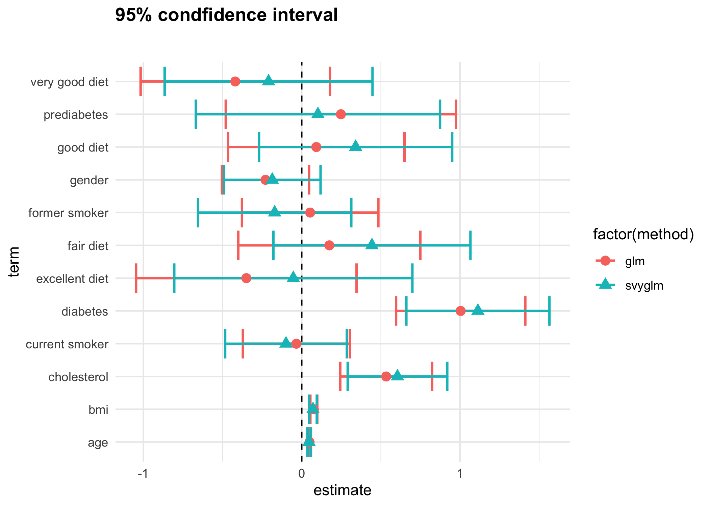

```{r setup, include=FALSE,warning = FALSE}
knitr::opts_chunk$set(echo = TRUE, message = FALSE, 
                      warning = FALSE)
options(digits = 2)
```

# Motivation

Hypertension is one of the most common diseases in the world. 
It has been associated with myocardial infarction, stroke, renal 
failure, and death if not detected early and treated appropriately.
Around 75 million American adults (32%) are estimated to have 
high blood pressure, costing the US around $48.6 billion 
each year. This total includes the cost of healthcare services, 
medications to treat high blood pressure, and missed days of work.

The link between hypertension and some physical measurements has 
been well-established in previous studies. In this case study, 
moving beyond the traditional aspects, we will explore other risk 
factors and their potential influence on hypertension.

This case study also introduces logistic regression and 
survey-weighted logistic regression, focusing on the comparison
between them. The plot below summarizes the results from this analysis 
illustrating that the standard error of coefficients calculated by the 
two models ([logistic regression](https://en.wikipedia.org/wiki/Logistic_regression) 
and [survey-weighted logistic regression](http://citeseerx.ist.psu.edu/viewdoc/download;jsessionid=9591E971AF4061BBF8F98083422FF313?doi=10.1.1.151.6423&rep=rep1&type=pdf))
are different. We will discuss later which model is a better choice 
for this dataset. 

<center>

</center>

The libraries used in this study are listed in the following table, 
along with their purpose in this particular case study:

|Library|Purpose|
|---|--------------------------------------------------------------------------------------------------------------|
|`ggplot2`| A system for declaratively creating graphics|
|`ggpubr`|Provides some easy-to-use functions for creating and customizing 'ggplot2'- based publication ready plots|
|`ggrepel`|Provides text and label geoms for 'ggplot2' that help to avoid overlapping text labels|
|`tidyverse`|A coherent system of packages for data manipulation, exploration and visualization |
|`kableExtra`|Help you build common complex tables and manipulate table styles, such as create awesome HTML table|
|`survey`|Provides useful functions to help you analyze complex survey sample|
|`haven`|A useful tool to import and export files from SAS, STATA, and SPSS|
|`plotrix`|Lots of plots, various labeling, axis and color scaling functions|
|`ggstance`|Provides flipped components: horizontal versions of 'Stats' and 'Geoms', and vertical versions of 'Positions'|
|`broom`|Takes the messy output of built-in functions in R, such as lm, nls, or t.test, and turns them into tidy data frames|


In order to run this code please ensure you have these packages installed. 

The learning objectives for this case study include:
  * data visualization
  * logistic regression
  * survey weight analysis
  * choose weight for unbalanced data

# What is the data?

For this case study, we will use the New York City (NYC)
[Health and Nutrition Examination Survey (NYC HANES)](http://nychanes.org/data/), 
modeled on the 
[National Health and Nutrition Examination Survey (NHANES)](https://wwwn.cdc.gov/nchs/nhanes/default.aspx). 
Just click `NYC HANES Analytics Datasets`, it will download automatically.
NHANES is a population-based, cross-sectional study with data collected 
from a physical examination and laboratory tests, as well as a face-to-face 
interview and an audio computer-assisted self-interview (ACASI). It is 
designed to assess the health and nutritional status of adults and children 
in the United States. NYC HANES is a local version of NHANES, which implies 
it mainly focus on New York area. 

The data we will use was collected from August 2013 to June 2014 and is called the 
[NYC HANES 2013-14 Blood Pressure Data](http://nychanes.org/wp-content/uploads/sites/6/2019/01/public_v3_122018.sas7bdat). 
The survey used a probability sample of non-institutionalized adult 
New York City residents (ages 20 years or older) to provide 
representative citywide estimates. For further details, please refer to 
its website.

There are other useful resources available on the website including: 

* [Data Documents](http://nychanes.org/wp-content/uploads/sites/6/2019/01/28283961_Data-Documentation.pdf): 
help data users navigate how best to analyze the NYC HANES 2013-14 dataset,given its population-based 
and clustered sampling scheme.
* [Analytics Guideline](http://nychanes.org/wp-content/uploads/sites/6/2015/11/ANALYTIC-GUIDELINES-2016_V2.pdf): 
provide overall guidance on the use of the NYC HANES 2013-14 dataset and statistical weights, 
as well as other analytic issues pertaining to assessing statistical reliability of estimates.
* [Variable Codebook](http://nychanes.org/wp-content/uploads/sites/6/2019/01/28283961_NYC-HANES_codebook_Public_V3_011019.pdf): 
describe the component of the study the variables come from.
* [Weight Adjustment](http://nychanes.org/wp-content/uploads/sites/6/2015/11/NYC-HANES-Training-Slides_part-2_08222016.pdf): 
explain how NYC HANES data are weighted in order to compensate for unequal probability of selection. 
It also teaches you how to choose the right weight.
* [Questionnaire](http://nychanes.org/wp-content/uploads/sites/6/2015/11/28283961_NYC-HANES-2013-14_Questionnaire.pdf)

All of them enable data users to understand the meaning and encoding of the variables better, 
and then complete the analysis more efficiently.
 
The NYC HANES is a population-based, cross-sectional study with data collected from a physical examination 
and laboratory tests, as well as a face-to-face interview and an audio computer-assisted self-interview (ACASI).

# Data import

Before doing anything, we should load the libraries needed for the case study.

```{r library-load}
library(knitr)
library(ggplot2)
library(ggpubr)
library(ggrepel)
library(tidyverse)
library(kableExtra)
library(survey)
library(haven)
library(broom)
library(plotrix)
```

The NYC HANES data file we are working with is a SAS formatted file so 
we would like to use the function `read_sas()` from the `haven` library 
to create a [tibble](https://tibble.tidyverse.org) 
(or `tbl_df`) in R. Tibbles are nice because they do not change variable 
names or data types, and they have an enhanced `print()` method which
makes them easier to use with large datasets containing complex objects. 
The [`haven` library](https://www.rdocumentation.org/packages/haven/versions/2.1.0) 
is useful to import and export files from 
[SAS, STATA, and SPSS](http://stanfordphd.com/Statistical_Software.html). 

```{r read-data}
dat <- read_sas('./data/d.sas7bdat')
```

This data frame contains `r nrow(dat)` observations of `r ncol(dat)` 
different variables. In our analysis, only a subset of the variables 
will be selected.


# Data wrangling

## Select the variables (or columns)

This is a survey dataset based on interviews or questionnaires
with `r ncol(dat)` variables. Some variables are not relevant 
to our current research question, such as 
_'LAQ1: What language is being used to conduct this interview'_. 

Previous people have shown hypertension is associated  with 
drinking, smoking, cholesterol values, and triglyceride levels. 
Excluding these variables, we will choose other covariates, which 
at first might not seem highly related to hypertension, such as 
income, and try to see whether they have an association with 
hypertension after all. Here, we selected 13 covariates for our 
analysis.  

We use the `select()` function from the `dplyr` package
to choose and rename the columns that we want. 

To show how the renaming of the column names works, I will give a simple example.

```{r}
rename <- 
  dat %>% 
    select(id = KEY,
           race = DMQ_14_1,
           diabetes = DX_DBTS)
colnames(rename)
```
Undoubtedly, compared with DMQ_14_1 and DX_DBTS, 
race and diabetes are more readable and more easily to understand.

```{r select-cols}
hypertension_df <- 
  dat %>% 
    select(id = KEY,
           age = SPAGE,
           race = DMQ_14_1,
           gender = GENDER,
           diet = DBQ_1,
           income = INC20K,
           diabetes = DX_DBTS,
           bmi = BMI,
           cholesterol = BPQ_16,
           drink = ALQ_1_UNIT,
           smoking = SMOKER3CAT,
           hypertension = BPQ_2,
           surveyweight = CAPI_WT)
```

For a description of the variables, we refer the reader to the
[Variable Codebook](http://nychanes.org/wp-content/uploads/sites/6/2019/01/28283961_NYC-HANES_codebook_Public_V3_011019.pdf).


### Non-categorical variables 

There are three non-categorial variables that we will use and 
the last variable `surveyweight` will be used in the modeling, 
which we will discuss later on: 

  * `id`: sample case ID
  * `age`: sample age, range 22-115
  * `bmi`: BMI = $kg/m^2$ where $kg$ is a person's weight in kilograms and $m^2$ is their height in meters squared
  * `surveyweight`: numeric values associated with each observation to let us know how much weight the observation should receive in our analysis.
  
### Categorical variables 

We will consider ten categorial variables: 

  * `race`: 
    + 100 = White
    + 110 = Black/African American
    + 120 = Indian
    + 140 = Native Hawaiian/Other Pacific Islander
    + 180 = Asian
    + 250 = Other race
  * `gender`:
    + 1 = Male
    + 2 = Female
  * `born`:
    + 1 = Us born
    + 2 = Other country
  * `diet`: 
    + 1 = Excellent
    + 2 = Very good 
    + 3 = Good
    + 4 = Fair
    + 5 = Poor
  * `diabetes`: previously diagnosed with diabetes
    + 1 = Diabetic with diagnosis
    + 2 = Diabetic without diagnosis 
    + 3 = Not diabetic
  * `cholesterol`: an oil-based substance. If concentrations get too high, it puts people at risk of heart diseases
    + 1 = High cholesterol value
    + 2 = Low cholesterol value
  * `drink`: In the past 12 months, how often did sample drink any type of alcoholic beverage
    + 1 = Weekly
    + 2 = Monthly
    + 3 = Yearly
  * `smoke`: 
    + 1 = Never smoker
    + 2 = Current smoker
    + 3 = Former smoker
  * `income`:
    + 1 = Less than $20,000
    + 2 = $20,000 - $39,999
    + 3 = $40,000 - $59,999
    + 4 = $60,000 - $79,999
    + 5 = $80,000 - $99,999
    + 6 = $100,000 or more
  * `hypertension`: previously diagnosed as having hypertension
    + 1 = Yes
    + 2 = No
    
## Initial data inspection

The first step of any data analysis should be to explore 
the data through data visualizations and data summaries, such as
tables and summary statistics. There are several ways that you 
can have a glance at your data. Plotting the data or using the 
`summary()` or `head()` functions in base R are excellent 
ways to help you have a quick judgement on the data set.

The `summary()` function tabulates categorical variables and 
provides summary statistics for continuous variables, while also 
including a count of missing values, which can be very important 
in deciding what variables to consider in downstream analysis.

```{r}
summary(hypertension_df)
```

We see that certain variables have a large number of `NA`s; in 
particular `drink` has `r sum(is.na(hypertension_df$drink))` 
`NA`s and `diabetes` has `r sum(is.na(hypertension_df$diabetes))` 
`NA`s. Directly removing rows containing missing data is not desirable 
considering the large number of such rows, so we decided to look more 
closely at the missing values. Using the 
[Variable Codebook](http://nychanes.org/wp-content/uploads/sites/6/2019/01/28283961_NYC-HANES_codebook_Public_V3_011019.pdf) again, 
we found another variable `AlQ_1` (how often did the survey participant drink any type of alcoholic beverage), 
where 0 means they never drink.

Let's look at the frequency of counts of the variable with 
function `table()`.

```{r}
table(dat$ALQ_1)
```

Now we see why there are so many missing values for `drink`. 
Among these `r sum(is.na(hypertension_df$drink))` missing values, 
`r sum(dat$ALQ_1 == 0, na.rm = TRUE)` samples never drink and 
there are just 
`r sum(is.na(hypertension_df$drink)) - sum(dat$ALQ_1 == 0, na.rm = TRUE)`
actual missing values. Therefore, merging these two variables 
as one is a better choice to avoid removing too many observations.

```{r}
hypertension_df$drink[which(dat$ALQ_1==0)] <- 4
summary(hypertension_df$drink)
```
We label those who never drink as 4 so now they are another new catergory in the dataset.

With the help of function `which()`, only 6 missing 
values for `drink` are left now.

In next step, we aim to remove rows containing missing 
data with the function `drop_na()` in library 
`tidyr` and store in a new data frame:

```{r}
hy_df <- 
  hypertension_df %>%
  drop_na()
```

This will drop all rows which still contain missing values. 
Finally, we see that we retain `r nrow(hy_df)` observations with
`r ncol(hy_df)` different variables.

## Adjust data types

From the data summaries above, we can see that there are several 
categorical variables like `race`, `gender`, `born`, `diet`, `income`, 
`diabetes`, `bmi`, `drink`, and `smoke`, which are currently being 
treated as numerical values, but should be treated as factors. 
Failing to change the type of data from numerical to categorial could
result in problems in the downstream analysis. 

For example, the linear model `lm()` and generalized linear model `glm()` 
functions will treat numerically-coded categorical variables as 
continuous variables, which will give the wrong result. Instead, 
we want to convert these categorical variables to factors. Before doing 
this, we want to get a better understanding of exactly what values 
are stored in the different variables. We refer to the 
[Variable Codebook](http://nychanes.org/wp-content/uploads/sites/6/2019/01/28283961_NYC-HANES_codebook_Public_V3_011019.pdf) 
to get the correct mapping of the numerical values 
to the category labels.

We can use the `factor()` function in base R to convert each 
variable and assign the correct levels. Any values that are not 
included in the `levels` argument will get set to `NA` values. 
We also want to think about creating a natural ordering to the 
factor levels here: the first level will generally be our 
reference level in a linear model, so it makes sense to try
to give them an order that reflects this.

```{r recodeFactors}
hy_df$race <- factor(hy_df$race, 
                     levels=c(100, 110, 120, 140, 180, 250), 
                     labels=c('White', 'Black/African American', 
                              'Indian /Alaska Native', 
                              'Pacific Islander', 
                              'Asian', 'Other Race'))

hy_df$gender <-  factor(hy_df$gender, levels=c(1,2), 
                        labels=c('Male', 'Female'))

hy_df$diet <-  factor(hy_df$diet, levels=c(5:1), 
                      labels=c('Poor', 'Fair', 'Good', 
                               'Very good','Excellent'))

hy_df$income <-  factor(hy_df$income, levels=c(1:6), 
                        labels=c('Less than $20,000','$20,000 - $39,999',
                                 '$40,000 - $59,999','$60,000 - $79,999',
                                 '$80,000 - $99,999','$100,000 or more'))

hy_df$diabetes <-  factor(hy_df$diabetes, levels=c(3,1,2), 
                          labels=c('Not diabetic','Diabetic dx','Diabetic but no dx'))

hy_df$cholesterol <-  factor(hy_df$cholesterol, levels=c(2,1), 
                             labels=c('Low value','High value'))

hy_df$drink <-  factor(hy_df$drink, levels=c(4,1,2,3), 
                       labels=c('Never','Weekly', 'Monthly', 'Yearly'))

hy_df$smoking <-  factor(hy_df$smoking, levels=c(3:1), 
                         labels=c('Never smoker','Former smoker','Current smoker'))

hy_df$hypertension <-  factor(hy_df$hypertension, levels=c(2,1), 
                              labels=c('No','Yes'))
```

Now let's look at a summary of our `hy_df` data frame. 

```{r}
summary(hy_df)
```


# Exploratory data analysis

Some simple data visualizations can help take a first look at 
the data and provide much information about how the different 
variables are related to one another. Plots can identify the trends 
or patterns in the variables you are interested in, and inspire you
in terms of the the next steps in your data analysis. For our 
data visualizations, we will mainly use the package `ggplot2`, 
a powerful tool for data visualization. A link for its cheat sheet is here: https://www.rstudio.com/wp-content/uploads/2015/03/ggplot2-cheatsheet.pdf.

Plotting numerical data is something you may be familiar with. 
This time we are going to incorporate some of the categorical variables 
into the plots. Although going from numerical data to categorical 
data bins does give you less precision, it can make drawing conclusions 
from plots much easier. 

First, we try to plot one categorical variable `hypertension`, with 
one numerical variable `age`.

```{r, fig.width=4, fig.height=4}
p1 <- hy_df %>% 
        ggplot(aes(x = hypertension, y=age)) +
          geom_boxplot() + 
          ggtitle('Distribution of age by hypertension status')
p1
```

What about `hypertension` with `gender`? Let's try three 
different ways to plot the categorical variable `gender`.

```{r, fig.width=11, fig.height=5}
p2 <- hy_df %>% 
        ggplot(aes(x = hypertension, y=gender)) + 
          geom_boxplot() + ggtitle('distribution of gender')
p3 <- hy_df %>% 
        ggplot(aes(x = gender, fill = hypertension)) + 
          geom_bar() + ggtitle('distribution of hypertension')
p4 <- hy_df %>% 
        ggplot(aes(x = gender, fill = hypertension)) + 
          geom_bar(position = "fill") + 
          ggtitle('distribution of hypertension') + 
          ylab('proportion')
ggarrange(p2, p3, p4, ncol=3, nrow=1)
```
`ggarrange()` in [package `ggpubr`](https://www.rdocumentation.org/packages/ggpubr/versions/0.2) 
is to arrange multiple ggplots on the same page. 

The left plot uses `geom_boxplot()` as we did with `age`, but 
it fails to show the relationship! Boxplots are not what we want 
for a categorical variable like `gender`, so we need another way, 
instead of just applying traditional plotting methods. 

The next two plots show alternative ways of looking at the 
relationship between `hypertension` and `gender`. This time it works! 
First, we switch the x-axis and y-axis, to show `hypertension` as a 
function of `gender`, rather than the other way around, as 
`hypertension` is our outcome variable of interest. The middle plot 
shows the count of individuals with and without hypertension for 
males and females and you can compare the two distributions. 
But to more clearly see the proportion of people with hypertension
among males and females for each level, we use `position='fill'`. 
The y-axis in the right plot is proportion rather than count. 
From this visualization, it is clear that a higher proportion 
of males than females in our dataset have hypertension. 

Next, we apply the same visualization methods on other 
variables and find if there exists a relationship between them

```{r, fig.width=9, fig.height=5}
p5 <- hy_df %>% 
        ggplot(aes(x = smoking, fill = drink)) + 
          geom_bar(position = "fill") + 
          ggtitle('smoking and drink') + ylab('proportion')
p6 <- hy_df %>% 
        ggplot(aes(x = cholesterol, fill = diabetes)) + 
          geom_bar(position = "fill") + 
          ggtitle('cholesterol and diabetes') + ylab('proportion')
ggarrange(p5, p6, ncol=2, nrow=1)
```

To my mind, these plots are pretty illuminating. From the left 
plot, we see that there are more monthly and yearly drinkers 
in current smokers, and more weekly drinkers in former smokers.
This may imply a potential relationship between smoking and drink. 
Additionally, the right plot shows that the proportion of 
diabetes patients are perfectly positive with high cholesterol 
value. Therefore potential relationship also exists in these 
two variables. 

What if we want to see relationship for more variables? 
This time we are going to incorporate three variables into the plots. 

```{r}
p7 <- hy_df %>% 
        ggplot(aes(x = cholesterol, y = bmi, fill = cholesterol)) +
          geom_boxplot() + facet_wrap(~ smoking, ncol = 3)
p7
```

The function `facet_wrap(~ smoking, ncol = 3)` uses the 
faceting capability to produce a plot with three panels 
(one panel for each smoking category). Within each panel 
is a boxplot which characterises the distribution of `bmi` for 
each cholesterol category within that `smoking` category. We 
realize that there is a tendency of increasing `bmi` from never 
smoker to current smoker, and the highest `bmi` values are 
found in current smokers. This provides a view on the data 
which is complementary to the previous boxplot above.

Based on these data visualizations, a potential relationship 
is revealed. So it is necessary to choose which variables
we might include our statistical model in the next section.  


# Data analysis

Now that we have spent some time cleaning and looking at 
data visualizations, we can consider using a statistical 
model to address our question of interest about which 
factors are related to risk of hypertension.

What model can we use in our case? Since we are looking 
at whether or not someone develops hypertension, our outcome
variable is **binary**. So you might think of logistic 
regression, and yes, you would be pretty close already. 
However, think of the nature of our dataset and how it was
collected. It is data obtained from a survey, and there is an 
important point to consider for analysis of survey data.

It is possible, and indeed often happens even with a perfectly
designed sampling plan, to end up with too many samples in a 
category. For example, too many women and not enough men, or 
too many whites and not enough other races. Data weighting 
makes sense for this kind of data. If we want the data to 
reflect the whole population, instead of treating each data 
point equally, we weight the data so that taken together,
our sample can more accurately reflect the entire community.


## Survey weights 

### How are survey weights determined?

Suppose that you have 25 students (20 male and 5 female) in your 
class, and you want to talk with 5 of them to gauge their 
understanding of the biostatistics class. By sampling 5 students 
from the total 25 students, you might get 5 all female students 
or 4 female and 1 male in your sample. Do you expect this sample 
to represent the population? Definitely not since there is a higher
proportion of females in the sample than the population. We can 
correct for this by weighting our samples so that, taken together, 
they better reflect the composition of the population we are 
generalizing to. 

Let's assume we sampled 4 females and 1 male from our population. 
To calculate the survey weights, we use the following formula:

$$Weight = \frac{Proportion~in~population}{Proportion~in~sample}$$
$$w_m=Male~Weight = \frac{20/25}{1/25} = 20$$
$$w_f=Female~Weight = \frac{5/25}{4/25} = 1.25$$

Therefore, 

$$ 1~observed~male* w_m = 20~males $$ 
and 
$$ 4~observed~females * w_f = 5~females$$ 

<center>

</center>

By weighting the observations, we can make the sample better 
represent the population.

When we have multiple strata on the data, it might be 
troublesome to calculate the weight. However, for many survey 
data sets such as ours, the appropriate weight has already been 
calculated and is included as a variable in the dataset. In 
our case study, the weight is calculated and we can simply 
apply this weight and perform a **survey-weighted logistic regression**.

### Selecting the weights

Because the NYC HANES 2013-2014 data have been collected to 
address a variety of different questions and using different 
surveys, the researchers who produced the data have employed a 
somewhat complex weighting scheme to compensate for unequal 
probability of selection. Five sets of survey weights have been 
constructed to correspond to different sets of variables that were
collected: CAPI  weight, Physical weight, Blood Lab result weight,
Urine Lab results weight and Salica Lab results weight. 
**The determination of the most appropriate weight to use for a specific analysis depends upon the variables selected by the data analyst**. 

When an analysis involves variables from different components
of the survey, the analyst should decide whether the outcome 
is inclusive or exclusive, and then choose certain weights. 
To learn how to use weights for different purposes, and you 
are suggested to go through
[Analytics Guideline](http://nychanes.org/wp-content/uploads/sites/6/2015/11/ANALYTIC-GUIDELINES-2016_V2.pdf). 

As the weight is given in the original dataset, we can use 
 `surveyweight` directly in our analysis. Here,
we choose CAPI weight, which should be used to analyze 
participants responses to all interview questions. All of our 
survey participants have a value for the `CAPI_WT` variable. 
We define hypertension as the prior diagnosis of high 
blood pressure, so we should use the most inclusive one, 
CAPI weight, to get an inclusive outcome. 

## Finite population correction factor

Now that we have discussed how to weight our samples, 
there is one more technical detail that we need to 
address when using survey data. Many methods for analysis 
of survey data make the 
**assumption that samples were collected using sampling with replacement**, 
i.e., any time a sample is drawn, each person in the population has 
an equal chance of being sampled, even if they have 
already been sampled. This is not usually how surveys
are actually carried out, so an adjustment may be necessary
to reflect this difference. This adjustment is called the
**finite population correction factor** and it is defined as:

$$FPC = (\frac{N-n}{N-1})^{\frac{1}{2}}$$
 
* `N` = population size
* `n` = sample size

In the case when the assumption above is violated (e.g. if you 
are sampling a sufficiently large proportion of the population), 
then you might sample the same persion twice. The finite 
population correction (FPC) is used to reduce the variance when
a substantial fraction of the total population of interest has 
been sampled. We got the value of `N` and `n` on the
[Analytics Guideline](http://nychanes.org/wp-content/uploads/sites/6/2015/11/ANALYTIC-GUIDELINES-2016_V2.pdf). 
Next let's calculate the FPC as below:

```{r}
N <-  6825749
n <- 1065
((N-n)/(N-1))^0.5
```

The FPC of our data set is very close to 1 and, in general, 
you can ingore it. But technically, since the data were
collected through sampling without replacement, 
it is more appropriate to use it.

## Specify the survey design

We now need to figure out how to specify the survey design 
and incorporate our sampling weights in our modeling steps. 
To help us do this, we use thefunction `svydesign()` in 
[package `survey`](https://cran.r-project.org/web/packages/survey/survey.pdf).
This function combines a data frame and all the design information needed to specify 
a survey design. Here is the list of options provided 
in this function:

* `ids`: Specify it for cluster sampling, `~0` or `~1` is a formula for no clusters. Cluster sampling is a multi-stage sampling, the total population are divided into several clusters and a simple random sample of clusters are selected. Each element in these clusters are then sampled.

* `data`: Data frame to look up variables in the formula arguments, or database table name

* `weights`: Formula or vector specifying sampling weights as an alternative to `prob`

* `fpc`: Finite population correction, `~rep(N,n)`  generates a vector of length n where each entry is N (the population size). Default value is 1. The use of fpc derives a without replacement sample, otherwise the default is a with replacement sample.
 
* `strata`: Specify it for stratified sampling, which divides members of the population into homogeneous subgroups and then sample independently in these subpopulations. It is advantageous when subpopulations within an overall population vary.
 
 
Now we use some options to create the design relative to our dataset:

```{r}
hypertension_design <- svydesign(
  id = ~1,
  #fpc = ~rep(N,n),
   weights = ~hy_df$surveyweight,
  data = hy_df[,-c(1,13)]
)
```
The arguments are interpreted as the following:

* `ids = ~1` means there is no cluster sampling
* `data = hy_df[,-c(1,13)]` tells `svydesign` where to find the actual data
* `weights= ~hy_df$surveyweight` tells it where to find the weight in our data frame

`summary()` shows the results:
```{r}
summary(hypertension_design)
```

"Independent sampling design" means our sampling design is a 
simple random sample (SRS). By setting other parameters 
you can also specify different kinds of designs, such as 
stratified or cluster sampling, etc.


## Calculate survey-weighted summary statistics

Once we have created our `survey.design` object, we can use the
convenient `svy*` functions to calculate summary statistics that
account for survey design features.

To calculate the mean and its standard error, use the function 
`svymean()`. The `svymean()` functino performs a weighted estimation
with each observation being weighed rather than direct calculation. 
We can compare this result to ignoring the survey weights using the
`mean()` and `std.error()` functions in base R:

```{r}
svymean(~bmi, hypertension_design)
```
```{r}
mean(hy_df$bmi)
std.error(hy_df$bmi)
```

It seems that there is not a very large difference between 
these two values and their standard errors. Since this is a
simple random sample the difference is not that obvious. 
But it will give precision estimates that incorporate the 
effects of stratification and clustering if you choose more 
complex sample design. 

To calculate the confidence interval, we can use the 
function `confint()` directly:

```{r}
confint(svymean(~bmi, hypertension_design))
```

Subgroup statistics are also easy to calculate with
function `svyby()`:
```{r}
svyby(~bmi, by=~diet, design=hypertension_design, 
      FUN = svymean)
```

If you are particularly interested in one group, 
you can use function `subset()` :


For example, if we are only interested in females
```{r}
svymean(~bmi, subset(hypertension_design,gender=="Female"))
```

or males 
```{r}
svymean(~bmi, subset(hypertension_design,gender=="Male"))
```

It seems that mean bmi and the associated SEs are a 
little higher for females compared to males. 


## Survey-weighted logistic regression

### Fit a simple model

$logit(p)= log(\frac{p}{1-p)})=X^{T}\beta$, where $p=P(Y=1)=E(Y)$ 

Logistic regression is widely used to deal with binary response 
variable. As we mentioned above, our dataset is a survey dataset, 
and we need to take survey weights into account, so therefore we 
need to fit the model with the survey weighted data. To do this,
we can just use the `svyglm()` function from the `survey` package.

It's similar to fitting a normal logistic regression, and the 
only difference is that instead of using the original data set 
in the `data` argument, you should input the object from the 
output of `svydesign()` to the `design` argument in the function.

First, we need to recode our factor output as a binary (0-1) variable. 

```{r}
hypertension_design$variables$hypertension <- 
  ifelse(hypertension_design$variables$hypertension == 'No', 
         yes = 0, no =1)
```

Then we fit our survey-weighted logistic regression model and 
look at the summarized output. Firstly, just start with a simple
model by choosing one variable. `smoking` is chosen for test:

```{r}
g <- svyglm(hypertension ~ smoking, 
    family = quasibinomial(), design = hypertension_design)
```

`tidy()` function in `broom` package can provide a dataframe 
representation about the models output. Just put the model
name in it and you will receive a nice dataframe!

```{r}
g_res <- tidy(g)
g_res
```

All of the prediction variables are list in `term` column and the left part 
is its corresponding estimation value, standard error etc. After substracting 
coefficient value and standard error, you can build confidence interval by hand.

What does the model output tells us about the relationship 
between predictor variables and the chance of getting hypertension? 
Look at coefficient table. For predictor variable `smoking`,
baseline setting is 'Never smoker'. Exponentiated coefficients
for 'Former smoker' is `r exp(g_res$estimate)[2]`, 
which means 'Former smoker' is associated with an odds of getting hypertension of 56% 
of that for 'Never smoker'; Similarly, 'Current smoker' is 
associated with an odds of getting hypertension of 69% 
of that for 'Never smoker'. What's more, we can see the 
p-value for `smoking` are all less than 0.05, suggesting 
their significance in this case.


### Fit a full model

After being familiar with how to interpret output of 
logistic regression model, try to fit a full model 
including all variables: 

```{r}
g1 <- svyglm(hypertension ~ 
               age + race + gender + diet + income + 
               diabetes + bmi + cholesterol + drink + smoking,
             family = quasibinomial(), 
             design = hypertension_design)
g1_res <- tidy(g1)
#g1_res[-3]
```

One interesting thing is that both the exponentiated 
coefficients and the p-value for `smoking` in this model 
increase sharply! Why will we get this change? 

Do you remember in section Exploratory data analysis, we found
there was a correlation between `smoking` and other variables.
This finding proves that when adding other variables, 
influence of former predictor variables are likely to change.

Now, let's interpret the new output. One categorical
variable and one continuous variable are chosen as examples:

* `smoking`: Holding all other variables the same, 'Former smoker' 
is associated with an odd of getting hypertension 
of `r exp(g1_res$estimate)[25]` of that for 'Never smoker'; 
'Current smoker' is associated with an odd of getting hypertension 
of `r exp(g1_res$estimate)[26]` of that for 'Never smoker'. 

* `bmi`: Holding all other variables the same, a unit increase in bmi 
changes odds by `r exp(g1_res$estimate)[20]`.

This step is pretty meaningful since it allows us to achieve 
more accurate result. When we try to understand the output,
holding all other variables the same is crucial. If we just 
do analysis based on the simple model, we cannot guarantee 
all other variables keep constant. However, the advantage of 
full model is that we compare all variables with others stable,
maximizing the chance to perform the same level comparison. 
Therefore our interpretation could be more precise and rational.


### Model selection

Not all variables in our model `g1` are significant, so we would 
like to remove some of them to get a reduced model. We find 
`race`,`income`, `diet`,`drink` and `smoking` are not that 
sigificant. Contrary to our common sense, `diet`,`drink` and 
`smoking` have minimum influence on hypertension when including
the other variables in the model. We believe this is because 
that their influence may be explained by other covariates, 
such as `bmi`. Therefore, here we just remove `race`, `drink` and `income`.

```{r,fig.width=7, fig.height=5}
g2 <- svyglm(hypertension ~ 
        age + bmi + cholesterol + diabetes + gender +
        smoking + diet, 
        family = quasibinomial(), 
        design = hypertension_design)
```

Using this model output, we would like to further examine 
which covariates have the larger influence on hypertension. 
To do this, we compare their effect sizes in the plot below.

```{r}
s <- data.frame('c' = exp(g2$coefficients[2:12]),
                'n' = names(g2$coefficients)[2:12])
s <- s[order(s$c),]
l = seq(from = 2, to = 12, by = 1)

plt<- ggplot(s, aes(x = l, y = c,col = s$c)) + 
  geom_point(size = 5)  + 
  scale_colour_gradient(low ='pink', high = 'darkred')+
  geom_hline(yintercept = 1,col = 'pink',size = 1.5, linetype = 2)+
  theme_bw() + theme(plot.title = element_text(hjust = 2, vjust = -2))+
  geom_text_repel(aes(y = c,label = n), col = 'darkred')+
  ggtitle("Effect on Hypertension") + 
  ylab("Odds Ratio") + 
  xlab("Features")+
  coord_flip()
  
plt
```

Here we plot the exponentiated coefficients, so that 
the effect is an odds ratio. If the value is larger than 1, 
the value of the covariate shown is associated with an 
increased probability of getting hypertension, and vice versa.
Moreover, a larger absolute value indicates a larger 
influence on response variable. 

We can conclude that people with diabetes, high value of 
cholesterol and fair diet have higher risk of getting 
hypertension compared to individuals with the baseline 
levels of these covariates. Also, among them, diabetes 
and cholesterol have the strongest relationship with 
hypertension, which is an accurate reflection of what 
we already know about hypertension. In all, with the 
help of a regression model like this, researchers could 
make an initial judgement about whether an individual may
have a high risk of hypertension, once these variables 
have been measured.

## Compare to logistic regression 

What would happen in this case if we were to use standard 
logistic regression using `glm()` instead of `svyglm()`

```{r}
g_svy <- glm(hypertension ~ smoking, 
          family = binomial(link = 'logit'), 
          data = hy_df)


g_svy_res <- tidy(g_svy)[-4]
g_svy_res
```


From the output, we see that all of the coefficients value 
rise. In order to compare them easily, merging these two output
into one would improve the efficiency. Only coefficient 
value and standard error are kept for better interpretation.

`merge()` function offer you an efficient way 
to merge two data frames by common columns or row names.

```{r}
merge(g_res[1:3], g_svy_res[1:3], by = 'term')
```

Therefore, compared with those who never smoke, the 
odds of getting hypertension for former smokers and current
smokers also change to `r exp(g_svy_res$estimate)[2]` 
and `r exp(g_svy_res$estimate)[3]` respectively; Second, 
standard errors calculated by svyglm are less than that 
calculated by glm, leading to a more accurate confidence 
interval; In conclusion, svyglm does better job than glm.

In the next step, let's compare the full model designed 
by these two methods. 

```{r}
g3 <- glm(hypertension ~ 
            age + bmi + cholesterol + diabetes + gender +
            smoking + diet, 
          family = binomial(link = 'logit'),
          data = hy_df)
#tidy(g3)
```

It is obvious `diabetes` and `diet` differ in exponentiated 
coefficients while that for the others vary slightly. 
Unlike the simple model, there are too many predict
variables in full model and it is cumbersome to compare 
them one by one. To guarantee a straight perception, 
we would like to visualize model output rather than show
them in a long table. 


## Visualization of model outputs

Repeat the same procedure we did for simple model,
we can construct the confidence interval manually.
Then save the information in one dataframe.

```{r}
g2_res <- tidy(g2) %>% 
  mutate(
    low = estimate - 0.95 * std.error,
    high = estimate + 0.95 * std.error,
    len = high-low,
    method = 'svyglm'
  )

g3_res <- tidy(g3) %>% 
  mutate(
    low = estimate - 0.95 * std.error,
    high = estimate + 0.95 * std.error,
    len = high-low,
    method = 'glm'
  )

#res <- merge(g2_res, g3_res, by = 'term')
res2 <- rbind(g2_res, g3_res)
#reorder the dataframe based on length of confidence interval
res2 <- res2[order(res2$len),][1:24,]
```

`mutate()` function is used to mutate a dataframe by 
adding new or replacing existing columns.

The label names are default setting, but to make it 
more readable, we can specify the label names.

```{r}
res2$term <- c('age' ,'age' ,'bmi','bmi',
'gender','cholesterol','gender',
'cholesterol','current smoker',
'diabetic with diagnosis','current smoker',
'diabetic with diagnosis', 'former smoker',
'former smoker', 'good diet','fair diet',
'very good diet','good diet','fair diet', 
'very good diet','excellent diet',
'diabetic without diagnosis','excellent diet',
'diabetic without diagnosis') 
```

Now, let's plot the confidence interval manually.

```{r, fig.width=8, fig.height=6}
ggplot(res2, aes(x = estimate, y = term),
     group_by(res2$method)) +
     geom_vline(xintercept = 0, linetype = "dashed") +
     geom_point(aes(color = factor(method),
                    shape = factor(method)),size = 3)+
     geom_errorbarh(aes(estimate, term, xmin = low, 
     xmax = high, color = factor(method),width = 0.3), size = 0.8)+
     theme(axis.title.x = element_blank(),
     axis.title.y = element_blank()) +
    ggtitle(expression(atop(bold("95% condfidence interval"))))
```

```{r, message=FALSE}
ggsave("data/Finalplot.png", plot = last_plot(), device = "png")
```

The red one is the confidence interval constructed by `svyglm()`
(`ci_svyglm`) while the black one is constructed by `glm()`(`ci_glm`)

Obviously, `cholesterol`, `diabetes`, `smoking` and `diet`
have larger differences in confidence intervals comparing 
the standard glm to the survey-weighted glm results, while 
`age`, `bmi` and `gender` have only small differences. 

Different with the result when we compare simple models,
`ci_svyglm` is larger than `ci_glm`. It is strange, 
isn't it? One possible reason behind this is `survey` computes 
the standard errors with consideration of the loss of precision 
introduced by sampling weights. Weights in `glm()` simply adjust 
the weight given to the errors in the least square estimation,
so the standard errors aren't correct in our context. 

# Summary of results

In this study, we investigated risk factors that might contribute to 
hypertension and use logistic regression to deal with binary 
response variable, while accounting for survey weights. 
The use of survey weights is the most important topic in this case 
study. Thus, we apply two approaches (with and without survey weights) 
to compare their results: one is general logistic regression and 
the other is survey weight logistic regression. 

To select the most appropriate model, in the first step, 
survey weight logistic regression (`svyglm()`) is applied 
considering our survey weight data set. Next, we delete 
several insignificant variables based on their p-value. Then,
we compare it with `glm()`. In each step we begin with a simple
model and then extend to the ideal one, a full model. This is 
well-grounded since we are able to analyze how the output changes
by setting all other variables stable. There is no doubt 
the same condition is the cornerstone of precise interpretation.

In output interpretation, we have taught you how to analyze 
the odds of getting hypertension with one categorical variable
example and one numerical variable example. Besides, we find
`diabetes` and `cholesterol` have strong positive effects on 
the probability of getting hypertension. And confidence intervals 
for `cholesterol`, `diabetes`,`smoking` and `diet` have obvious 
difference. It is wired that in simple model, `ci_svyglm` is shorter
than `ci_glm` while in full model the results change to the opposite. 
One potential explanation is the incompleteness of `glm()`. But 
`svyglm()` are more likely to give an accurate results since it 
consider sampling weight. Therefore we still believe, for survey 
weight data, `svyglm()` should be the first choice than others.

In the future, we can make more efforts on applied survey methods
and decide whether there exist better approaches, such as stratified sample. 

